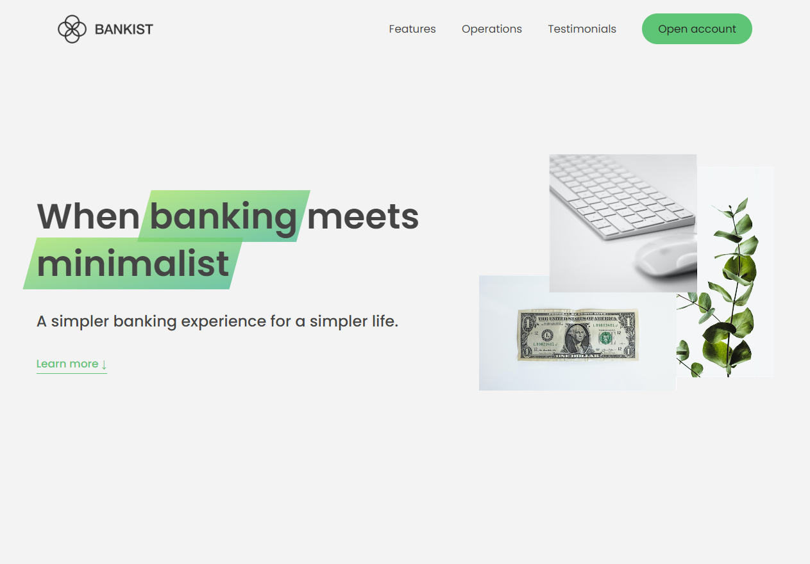

<h1 align="center"> Bankist Website</h1>

<h3>A website with more responsive features implemented with Pure javascript </h3>

### DEMO

### [LIVE DEMO](https://rawan-kh.github.io/Kalbonyan-Elmarsos/2-Udemy/2-Js/projects/BankistWebsite/)

## Website Features 
- smooth scrolling
- sticky nav bar
- Button scroll
- Tab component
- Carousel (image slider)
- windows modal 
- reveal on scroll animation
- lazy loading images

